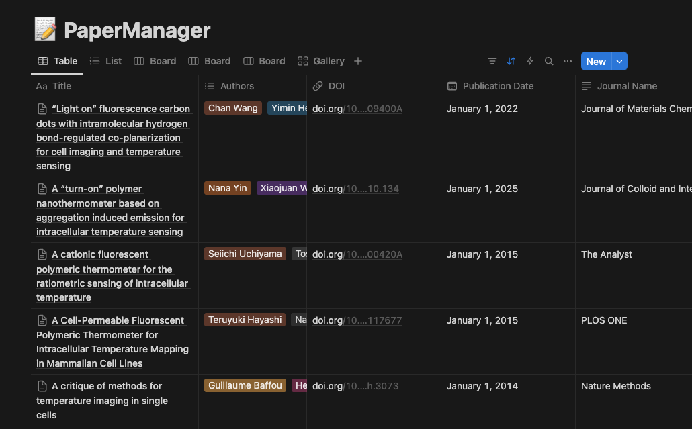
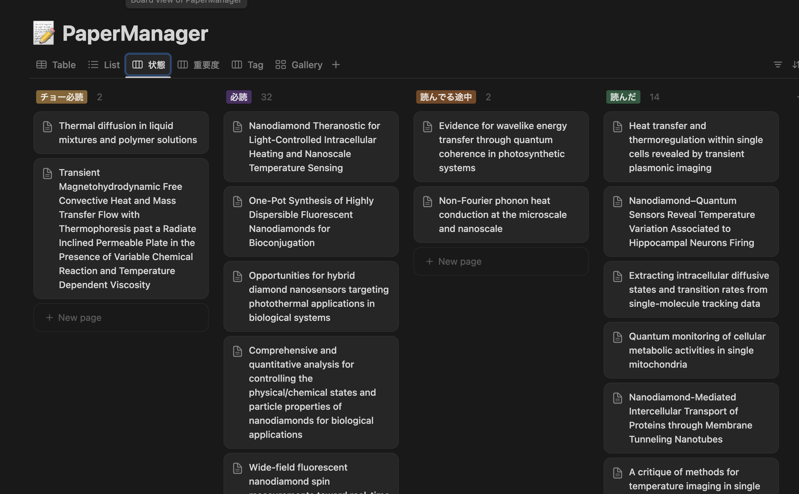

# Paper Manager – Notionでの論文管理のツール

このツールは、DOIを入力するだけで、論文情報をNotionのデータベースに自動登録するGUIアプリケーションです。

## 🚀 特徴

- DOIからBibTeX情報を取得
- 著者・タイトル・ジャーナル名・出版日をNotionデータベースに登録
- 登録日は自動追加

## 🛠️ セットアップ

### NotionのAPIの準備
このアプリはNotion APIを使用します。

- Notion Integrationを作成
- シークレットトークン（NOTION_TOKEN）を取得
- 対象データベースのID（DATABASE_ID）を取得
- 作成したIntegrationに対象データベースへのアクセス権限を与える

参考：https://qiita.com/__Tetsutaka__/items/1c45f463f0ff665274f4

### データベースのプロパティの設定

以下のタイプのプロパティを作成してください。
このほかにプロパティを作成しても良いですが、以下のプロパティは不足なく作成してください。

| プロパティ名         | タイプ                      |
|----------------------|-----------------------------|
| Title                | タイトル（title）           |
| Authors              | マルチセレクト（multi-select） |
| Publication Date     | 日付（date）                |
| Journal Name         | テキスト（rich text）       |
| DOI                  | URL                         |

### Pythonコードを編集

以下の2つの変数を、自分のNotionの情報に置き換えてください。

```
NOTION_TOKEN = "あなたのNotionのシークレットトークン"
DATABASE_ID = "あなたのデータベースID"
```

## 🖥️ 使い方

1. アプリを実行するとウィンドウが表示されます。

2. テキストボックスにDOI（例: 10.1038/s41586-020-2649-2）を入力。
   - https://doi.org/〜 形式でもOKです。

3. 「送信」をクリック。

4. 成功すると「✅ Notionに追加成功！」と表示されます。

## Macでのアプリケーション化

Automatorを用いることで、PaperManager.py をMacでダブルクリック実行できるアプリにできる。

1. **Automator を起動**
   - Spotlight で「Automator」と検索して起動
   - 新規書類 > 「アプリケーション」を選択

2. **「シェルスクリプトを実行」を追加**
   - 検索バーで「シェルスクリプトを実行」と入力
   - ダブルクリックまたはドラッグしてワークフローに追加

3. **以下のようなスクリプトを入力（例：Conda環境使用時）**

以下のコードは「PaperManager」というconda仮想環境を用いた場合である。
```bash
#!/bin/zsh
source /Users/あなたのユーザー名/anaconda3/bin/activate PaperManager
python /Users/あなたのパス/PaperManager.py
```

## Notionを使用する意義
このプログラムで作成されたデータをNotionに登録することで、以下のような利点があります
- 📌 **カスタムプロパティの追加が可能**  
  Notion上で「状態（未読・読了など）」や「タグ（研究分野・重要度など）」といったプロパティを**手動で追加・管理**できます。

- 🧱 **Boardビューでの視覚的な管理**  
  Notionの「ボードビュー」を使えば、論文を**カード形式でカテゴリ別に整理**することができ、直感的に進捗管理や分類が可能になります。

